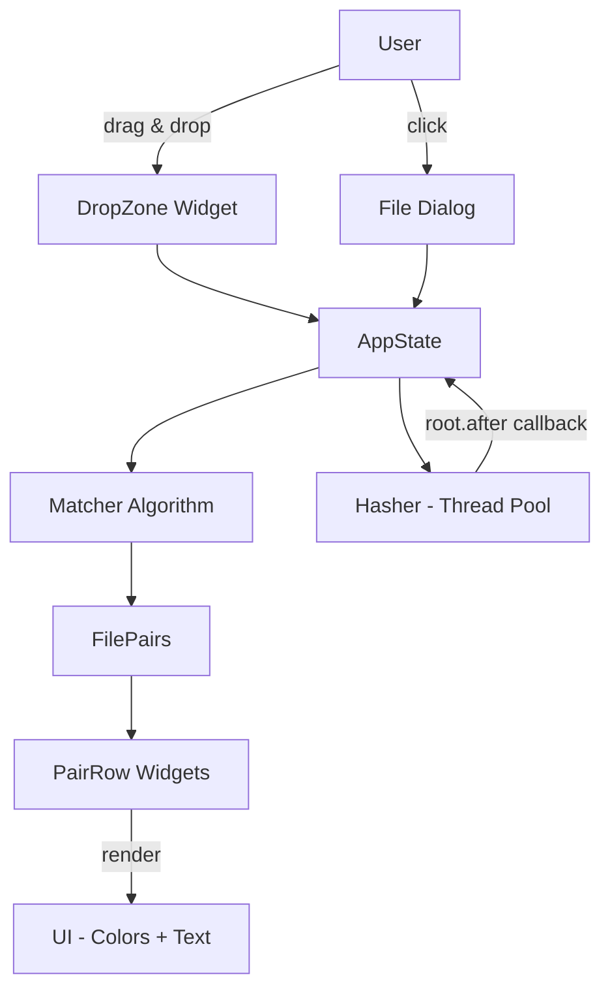
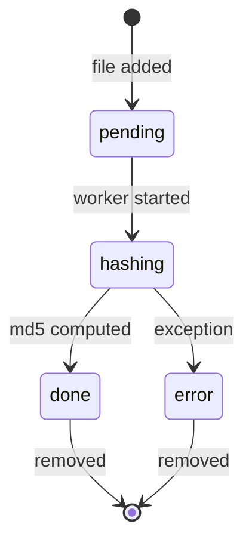

# Architecture: HashDiff

## Overview

HashDiff — single-process desktop приложение. Никакого сервера, никаких баз данных, никакого сетевого взаимодействия.

```
┌─────────────────────────────────────────────────┐
│                   HashDiff.exe                  │
│                                                 │
│  ┌─────────────┐    ┌──────────────────────┐    │
│  │   UI Layer   │    │    Core Layer        │    │
│  │  (Tkinter)  │◄──►│  - MD5 engine        │    │
│  │             │    │  - Matching algo     │    │
│  │  DropZone   │    │  - State management  │    │
│  │  PairRows   │    │                      │    │
│  │  Buttons    │    ┌──────────────────────┐    │
│  └─────────────┘    │  Thread Pool         │    │
│                     │  (background hash)   │    │
│                     └──────────────────────┘    │
└─────────────────────────────────────────────────┘
        │
        ▼
   Windows File System (read-only access)
```

## Tech Stack

| Component | Technology | Reason |
|-----------|------------|--------|
| Language | Python 3.11 | Богатая stdlib, hashlib встроен |
| GUI | customtkinter | Современный вид поверх Tkinter |
| Drag & Drop | tkinterdnd2 | Единственное рабочее DnD для Tkinter+Windows |
| Hashing | hashlib (stdlib) | MD5 встроен, streaming из коробки |
| Threading | threading (stdlib) | Фоновое хеширование без блокировки UI |
| Packaging | PyInstaller | Single exe, Windows-friendly |
| Icons | Pillow (опционально) | Для .ico иконки приложения |

## File Structure

```
hashdiff/
├── src/
│   ├── app.py              # Entry point, AppState, main window
│   ├── models.py           # FileEntry, FilePair dataclasses
│   ├── hasher.py           # MD5 streaming, async wrapper
│   ├── matcher.py          # Matching algorithm
│   └── ui/
│       ├── drop_zone.py    # Drag & drop zone widget
│       ├── pair_row.py     # Single comparison row widget
│       └── scrollable.py   # Scrollable frame helper
├── assets/
│   └── icon.ico
├── requirements.txt
├── build.bat               # PyInstaller build script
└── README.md
```

## Threading Model

```
Main Thread (Tkinter event loop)
  │
  ├── User action → update state → refresh UI
  │
  └── Spawn worker threads for hashing
        │
        Worker Thread 1: hash file A
        Worker Thread 2: hash file B
        ...
        │
        └── on_complete → root.after(0, callback)
              → safely update UI from main thread
```

**Правило:** UI обновляется ТОЛЬКО из main thread через `root.after(0, fn)`.

## Dependency Versions (requirements.txt)

```
customtkinter==5.2.2
tkinterdnd2==0.3.0
Pillow==10.3.0        # опционально, для icon
pyinstaller==6.6.0    # dev-only
```

## Build Process

```bat
:: build.bat
pyinstaller ^
  --onefile ^
  --windowed ^
  --name HashDiff ^
  --icon assets/icon.ico ^
  --add-data "assets;assets" ^
  src/app.py
```

**Output:** `dist/HashDiff.exe` (~20-25 MB)

## Mermaid: Component Diagram



## Mermaid: State Machine (FileEntry)



## Constraints Compliance

| Constraint | Solution |
|------------|----------|
| Windows only | tkinterdnd2 Windows-native DnD |
| Single exe | PyInstaller --onefile |
| No install | --windowed (no console), bundled Python |
| Unicode paths | pathlib.Path everywhere |
| Large files | Streaming 8192-byte chunks |
| Non-blocking UI | threading.Thread + root.after |

> **Примечание архитектуры:** Этот проект — desktop utility, не web-приложение. Целевая архитектура Distributed Monolith + Docker + VPS не применяется. Проект упаковывается как единый .exe для Windows.
